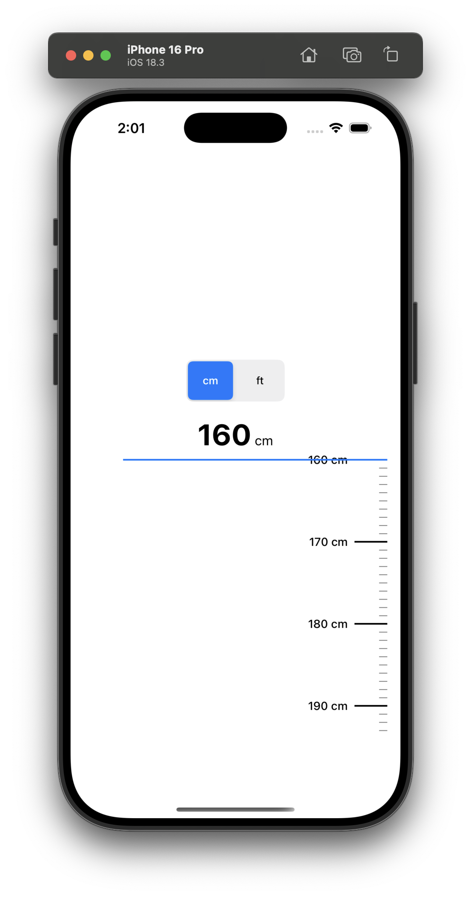
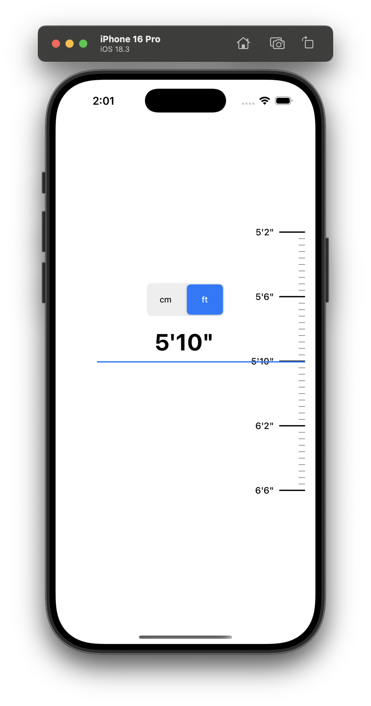

# HeightScaleView

HeightScaleView is a customizable Swift UI component that provides an interactive height selection interface, similar to a physical measuring scale. It supports both metric (centimeters) and imperial (feet/inches) units, making it ideal for health, fitness, or onboarding apps where users need to select their height.

## Features

- Interactive scrolling height selection (default: 120cm to 220cm, customizable)
- Visual scale with markings for each centimeter
- Prominent markings and labels for each 10cm increment
- Segmented control to toggle between metric (cm) and imperial (ft/in) units
- Haptic feedback when scrolling between values
- Formatted display of the current height value
- Easy integration and customization

## Installation

### Swift Package Manager

Add HeightScaleView to your `Package.swift` dependencies:

```swift
.package(url: "https://github.com/yourusername/HeightScaleView.git", from: "1.0.0")
```

And add it to your target dependencies:

```swift
.target(
    name: "YourApp",
    dependencies: [
        .product(name: "HeightScaleView", package: "HeightScaleView"),
        // ...
    ]
)
```

> **Note:** HeightScaleView depends on [TinyConstraints](https://github.com/roberthein/TinyConstraints) for layout.

## Usage

### Basic Example

```swift
import HeightScaleView

// Create a height scale with default range (120-220cm)
let heightScale = HeightScaleView()

// Or with a custom range
let customHeightScale = HeightScaleView(minimumValueInCM: 100, maximumValueInCM: 200)

// Add to your view hierarchy
view.addSubview(heightScale)

// Set constraints (using TinyConstraints)
heightScale.edgesToSuperview()

// Access the current value
let selectedHeight = heightScale.currentValue
```

### Unit Switching

The view includes a segmented control to toggle between centimeters and feet/inches. All scale labels and the current value update automatically when the unit is changed.

## Customization

- **Minimum/Maximum Value:**
  - Set via the initializer: `HeightScaleView(minimumValueInCM: 120, maximumValueInCM: 220)`
- **Appearance:**
  - Customize fonts, colors, and tick mark lengths by modifying the source.
- **Haptic Feedback:**
  - Uses medium impact by default. You can adjust the feedback style in the source if needed.

## Example





## License

MIT License. See [LICENSE](LICENSE) for details.
